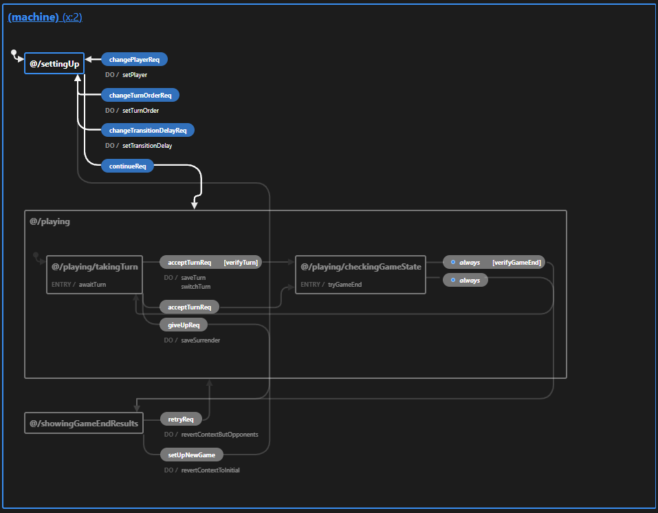
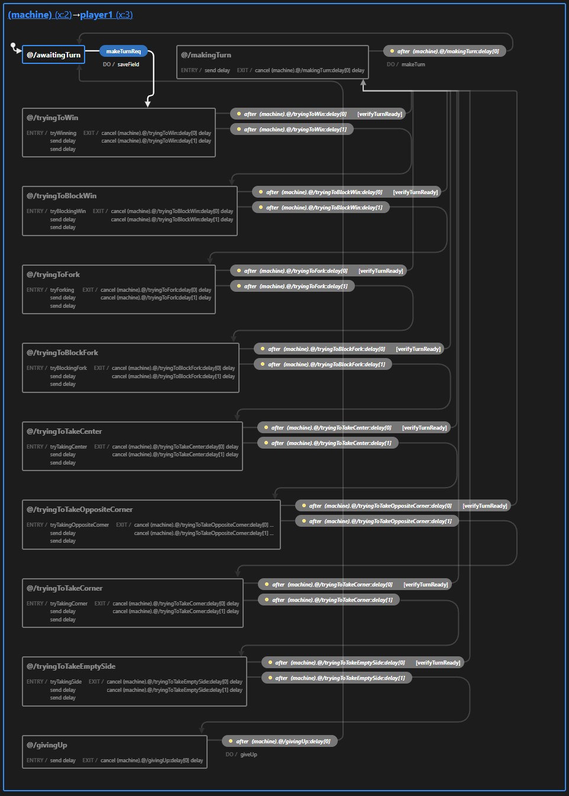

# Abstract

Tic-tac-toe with actors using `xstate`. 

[Live Demo](https://mrnovado.github.io/xstate-tic-tac-toe/)

Play against other player/AI, or watch a match between AIs.

~Fully typed using `TypeScript`.

# How to

To install and run:
- clone the repo
- `yarn`
- `yarn start`

NOTE: don't forget you can always switch machines in the inspector frame:

  

# Machine

Machine is organized to operate in 3 simple phases:
- setting-up a game (creating actors)
- playing and taking turns
- showing results

  

# Actor
Actor is using Newell and Simon's expert model with rule ordering.

You can read more about it here:
- https://en.wikipedia.org/wiki/Tic-tac-toe#Combinatorics
- https://en.wikipedia.org/wiki/Tic-tac-toe#Strategy
- https://doi.org/10.1016%2F0364-0213%2893%2990003-Q

Basically, actor follows a predetermined path to win.

The implementation, however, is using random `sampling` when it comes to selecting a move between other equally valid ones (i.e. when trying to take a free corner/side, when several are available).  

  

